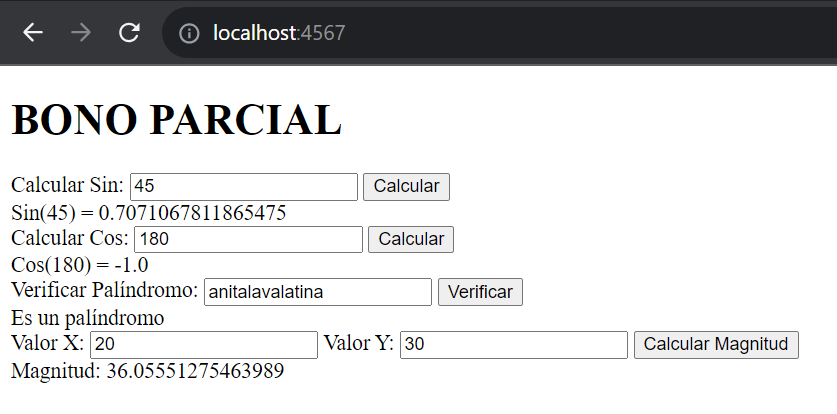
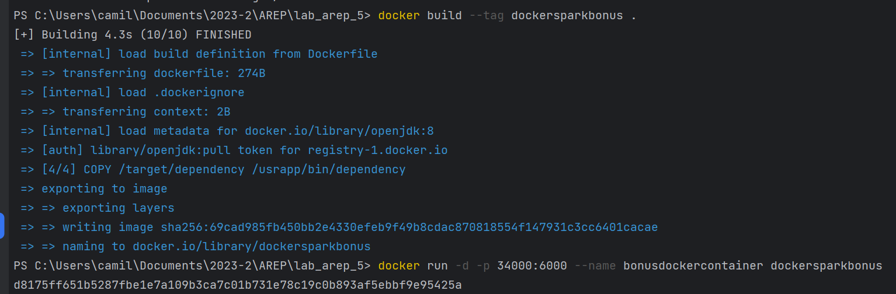
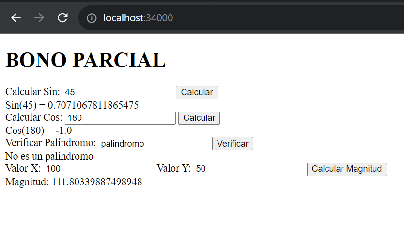
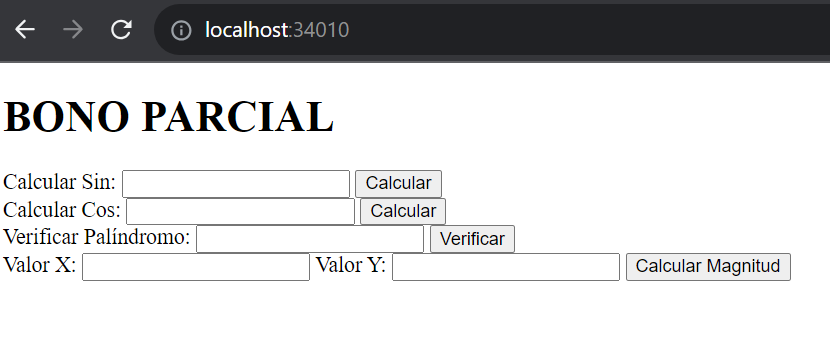

# BONO PARCIAL / TALLER DE DE MODULARIZACIÓN CON VIRTUALIZACIÓN E INTRODUCCIÓN A DOCKER

## Getting Started

Estas instrucciones te ayudarán a obtener una copia del proyecto en funcionamiento en tu máquina local para desarrollo y pruebas. Consulta la sección de "Despliegue" para obtener notas sobre cómo implementar el proyecto en un sistema en vivo.

### Prerequisites

Cosas que necesitas instalar y cómo hacerlo.

- [Java Development Kit (JDK)](https://www.oracle.com/java/technologies/javase-jdk11-downloads.html)
- [Maven](https://maven.apache.org/install.html)
- [DockerDesktop](https://www.docker.com/products/docker-desktop/)

### Installing

Sigue estos pasos para configurar tu entorno de desarrollo:

1. Clona el repositorio:

   ```bash
   https://github.com/juan-bazurto-eci/bonus_arep.git
2. Navega al directorio del proyecto

    ```
   cd bonus_arep
   ```

3. Hacemos la construccion del proyecto

   ```
   mvn package
   ```

## Deployment

Ejecutamos los siguientes comandos

    mvn clean package install
    mvn clean install

Corremos el servidor

	 java -cp "target/classes;target/dependency/*" co.edu.escuelaing.arep.SparkWebServer

Accedemos a la siguiente URL

	 https://localhost:4567/

## Running the tests

El servidor responde a todas las funciones



También se creo la imagen y el servidor corre con docker





También podemos correr la imagen que subimos a dockerhub

    docker run -d -p 34010:6000 --name bonusdockerhub juanbazurtoeci/bonus_arep



## Built With
* [Java](https://www.java.com/) - Lenguaje de programación principal
* [Maven](https://maven.apache.org/) - Gestión de dependencias y construcción del proyecto
* Git - Control de versiones
* [DockerHub](https://hub.docker.com/)
* [SparkJava](https://sparkjava.com/)
* HTML, JavaScript - Interfaz de usuario

## Authors

* **Juan Camilo Bazurto** - [Linkedin](https://www.linkedin.com/in/juan-camilo-b-b65379105/) - [GitHub](https://github.com/juan-bazurto-eci)